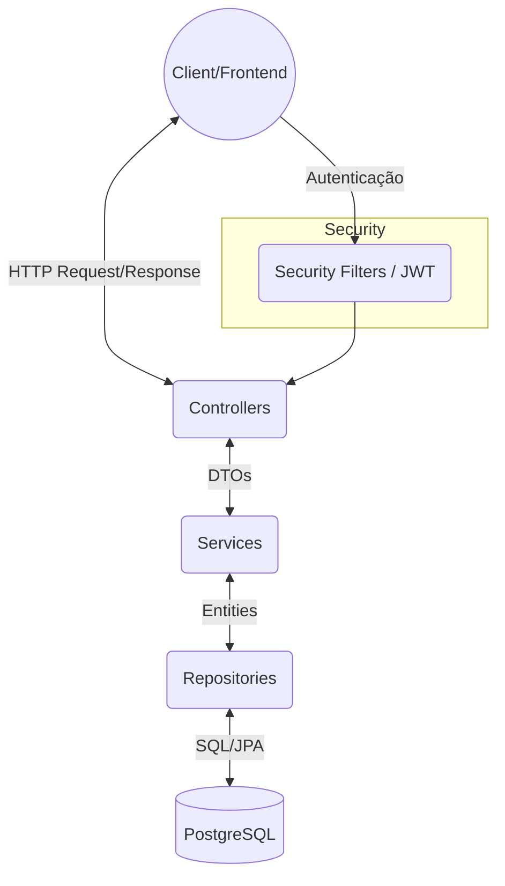
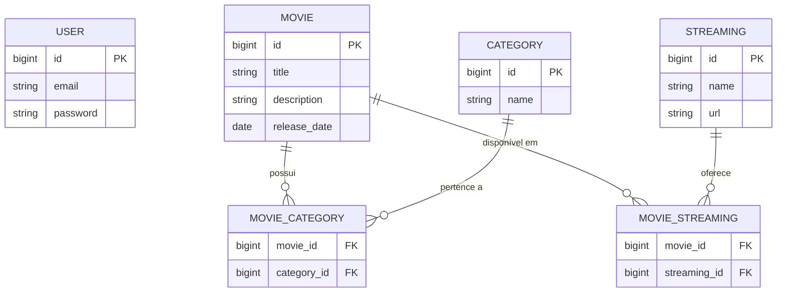

# MovieFlix 🎬

O **MovieFlix** é uma API RESTful desenvolvida com Spring Boot para o gerenciamento de um catálogo de filmes. Ele permite o cadastro de filmes, suas respectivas categorias (gêneros), e em quais plataformas de streaming eles estão disponíveis. O projeto também conta com sistema de autenticação de usuários utilizando JWT.

## 🚀 Tecnologias Utilizadas

Este projeto foi construído utilizando as seguintes tecnologias:

*   **Java 17**
*   **Spring Boot** (Web, Data JPA, Security, Validation)
*   **PostgreSQL** (Banco de dados relacional)
*   **Flyway** (Migração e versionamento de banco de dados)
*   **JWT (JSON Web Token)** (Autenticação e autorização via token)
*   **SpringDoc OpenAPI (Swagger)** (Documentação da API)
*   **Lombok** (Redução de boilerplate code)
*   **Docker & Docker Compose** (Containerização do banco de dados)
*   **Maven** (Gerenciamento de dependências e build)

---

## 🏛️ Arquitetura

A aplicação segue a arquitetura em camadas (MVC/Layered Architecture) padrão do Spring:

*   **Controllers:** Responsáveis por receber as requisições HTTP, delegar a lógica de negócios para os Services e retornar a resposta adequada.
*   **Services:** Contêm a lógica de negócios da aplicação e orquestram a comunicação entre os Repositórios e outras partes do sistema.
*   **Repositories:** Interfaces Spring Data JPA responsáveis pela comunicação e persistência com o banco de dados.
*   **Entities:** Modelos de domínio que mapeiam as tabelas do banco de dados via JPA/Hibernate.
*   **Mappers/DTOs:** Responsáveis pela transferência de dados entre o cliente e a API, isolando o modelo de domínio (Entities).
*   **Exceptions:** Tratamento centralizado de erros da API.

### Fluxograma da Arquitetura



---

## 💾 Modelagem de Dados

O modelo de dados contempla a relação entre Filmes, Categorias, Plataformas de Streaming e Usuários (para autenticação).

*   **User:** Armazena as credenciais para acesso à API.
*   **Movie:** Entidade central com os dados do filme.
*   **Category:** Gênero ou categoria do filme (Ação, Comédia, etc).
*   **Streaming:** Plataformas de streaming (Netflix, Prime Video, etc).

Existe um relacionamento de "Muitos-para-Muitos" (N:M) entre Filmes e Categorias, e Filmes e Streamings, que é gerenciado pelo banco de dados através das tabelas associativas criadas nas migrations do Flyway.

### Diagrama de Entidade-Relacionamento (ERD)



---

## ⚙️ Pré-requisitos

Para rodar este projeto localmente, você vai precisar de:

1.  **JDK 17** instalado na sua máquina.
2.  **Docker** e **Docker Compose** instalados (para rodar o PostgreSQL de forma facilitada).
3.  **Maven** (ou você pode usar o Wrapper `.mvnw` incluso no projeto).

---

## 🛠️ Como Executar

### 1. Subir o Banco de Dados

O projeto conta com um arquivo `docker-compose.yml` na raiz. Para iniciar o banco de dados PostgreSQL, execute:

```bash
# Na raiz do projeto
docker-compose up -d
```
*Observação: Verifique se as variáveis de ambiente `${USERNAME}`, `${PASSWORD}`, e `${DATABASE}` estão configuradas ou substitua no arquivo docker-compose se preferir rodar com valores fixos.*

### 2. Rodar a Aplicação

As migrações do banco de dados ocorrerão automaticamente ao iniciar a aplicação graças ao **Flyway**.

Para compilar e iniciar a aplicação Spring Boot, use o Maven Wrapper:

No Windows:
```cmd
mvnw spring-boot:run
```

No Linux/Mac:
```bash
./mvnw spring-boot:run
```

A aplicação subirá por padrão na porta `8080`.

---

## 📚 Documentação da API (Swagger)

O projeto possui a integração com o SpringDoc para gerar a documentação interativa da API via Swagger UI.

Com o projeto rodando, acesse a documentação através do navegador em:
**http://localhost:8080/swagger-ui.html**

*Nota: Para interagir com endpoints protegidos, você precisará gerar um Token JWT no endpoint de autenticação e injetá-lo no Swagger (botão "Authorize").*
